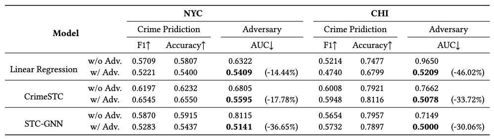

# DebiaseCrime

This is the official implement of our work `Breaking the Prejudice Loop: Achieving Unbiased Crime Prediction via Causal Analysis and Adversarial Training`.

## Installation

### Quick Start.

```
pip install -r requirements.txt
```

## Running the code

Run our code with default settings:

```
python main.py
```

## Results
Here are the reported results on NYC and CHI datasets:



